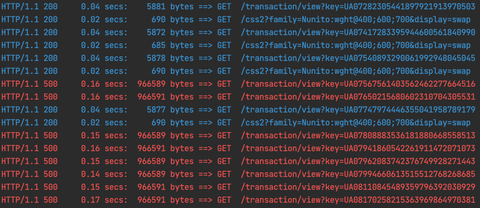
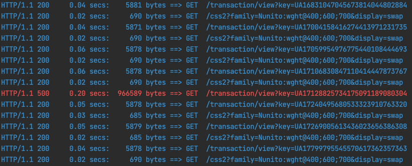

# projector-l91

## Installation

Clone the repository.
Run ``` docker-compose up --scale redis-sentinel=3 -d``` command to launch application. This will launch all required containers inclusing 3 redis sentinels. 

After running container run ```docker inspect src-redis-1``` to get redis master IP and set it's IP in **src/redis/redis-sentinel/conf/sentinel.conf** 172.21.0.2. Restart sentinel containers: \
```docker container restart src-redis-sentinel-1 src-redis-sentinel-2 src-redis-sentinel-3```

Please note: not all redis sentinels will launch after docker-compose due to the error: 
>Error response from daemon: Ports are not available: exposing port TCP 0.0.0.0:26380 -> 0.0.0.0:0: listen tcp 0.0.0.0:26380: bind: address already in use

you may need to start containers manually. 

Docker exec to the laravel application container, run:\
* ```composer install```
* ```php artisan migrate``` to create database tables
* ```php artisan db:seed --class=TransactionSeeder ```

## Probability cache

Function implemented in ```\App\Models\Transaction::probabilisticExarlyExpire``` (src/app/Models/Transaction.php). There are defined item reload chances: 

40% chance if ttl is between 20% and 30% left \
70% chance if ttl is between 100% and 20% left \
90% chance if ttl is lower than 10% of the initial value. 

As a result we have different probability chance to reload item from DB. The smaller the ttl, the higher the chance to reload record: 

key: UA02019732340488001098769755, ttl: 9, chance: 0, cache reset:  \
key: UA02019732340488001098769755, ttl: 9, chance: 0, cache reset:  \
key: UA02019732340488001098769755, ttl: 9, chance: 0, cache reset:  \
key: UA02019732340488001098769755, ttl: 8, chance: 40, cache reset:  \
key: UA02019732340488001098769755, ttl: 8, chance: 40, cache reset:  \
key: UA02019732340488001098769755, ttl: 8, chance: 40, cache reset:  \
key: UA02019732340488001098769755, ttl: 8, chance: 40, cache reset:  \
key: UA02019732340488001098769755, ttl: 8, chance: 40, cache reset:  \
key: UA02019732340488001098769755, ttl: 8, chance: 40, cache reset:  \
key: UA02019732340488001098769755, ttl: 8, chance: 40, cache reset:  \
key: UA02019732340488001098769755, ttl: 8, chance: 40, cache reset:  \
**key: UA02019732340488001098769755, ttl: 8, chance: 40, cache reset: 1**\
key: UA02019732340488001098769755, ttl: 30, chance: 0, cache reset:  \
key: UA02019732340488001098769755, ttl: 30, chance: 0, cache reset:  \
key: UA02019732340488001098769755, ttl: 30, chance: 0, cache reset:

Can be tested using the siege tool running ```siege -r50 -c10 --file=./public/siege_urls_probability.txt``` command from the src dir. Records are written to the ./public/cache.log file. 

## Eviction policies testing

Defined ```maxmemory 900kb``` in ```src/redis/conf/redis.conf```. Generated urls to view transaction pages.

#### noeviction

Started to receive errors when had 52 records in redis:\
db0:keys=52,expires=52,avg_ttl=527131



#### volatile-lru

Had to increase memory to 1mb.

When I had ```keyspace_misses:139``` redis evicted almost the whole cache and started to write from scratch ```evicted_keys:133```

Only a single request failed:



Transactions:                    296 hits\
Availability:                  99.66 %

#### allkeys-lru

When there were 226 keys recorded\ 
db0:keys=226,expires=226,avg_ttl=593942 \
part of records were deleted \
evicted_keys:86 \
db0:keys=166,expires=166,avg_ttl=593662

no errors in requests 

#### volatile-lfu

evicted_keys:0
db0:keys=202,expires=202,avg_ttl=594394

evicted_keys:93
db0:keys=118,expires=118,avg_ttl=594078

no errors

#### allkeys-lfu

ran 200 queries

evicted_keys:0
db0:keys=200,expires=200,avg_ttl=590994

next queries caused 80 keys removal

evicted_keys:80
db0:keys=123,expires=123,avg_ttl=584923

#### volatile-random

ran 200 queries

evicted_keys:0
db0:keys=200,expires=200,avg_ttl=582688

ran 50 queries more, 58 keys were evicted, some recreated

evicted_keys:58
db0:keys=151,expires=151,avg_ttl=565537

#### allkeys-random

ran 200 queries

evicted_keys:0
db0:keys=200,expires=200,avg_ttl=582688

ran 50 queries more, 46 keys were evicted

evicted_keys:46
db0:keys=156,expires=156,avg_ttl=546461

#### volatile-ttl

ran 200 queries

evicted_keys:0
db0:keys=200,expires=200,avg_ttl=594323

ran 50 queries more, evicted almost whole cache

expired_keys:0
evicted_keys:140
db0:keys=90,expires=90,avg_ttl=587674
